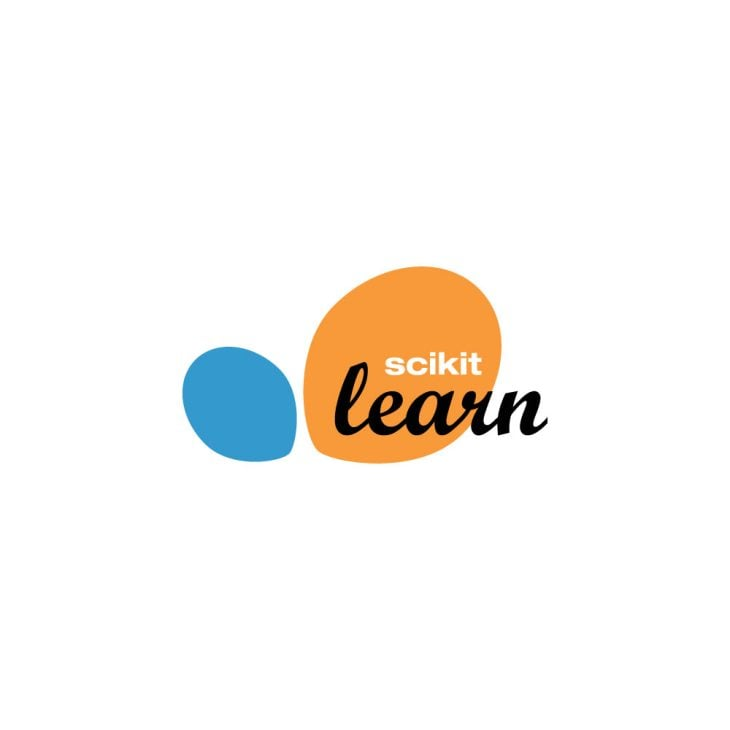
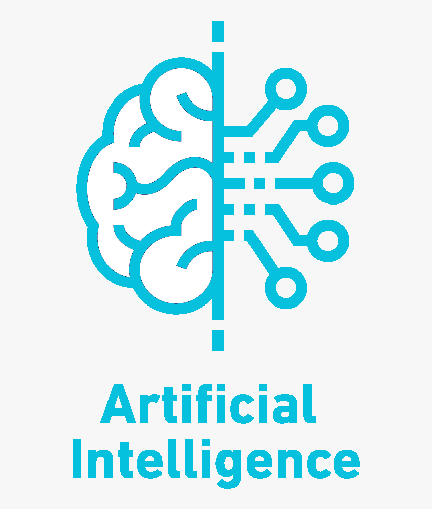

<h1 align="center">Hi 👋, I'm Karthikraghavan Annamalai</h1>
<h3 align="center">An Associate Data Scientist from India</h3>

  

- 🔭 I’m currently working in **Cognizant Technology Solutions**

- 💬 Ask me about **Data Science**

- 📫 How to reach me **kr.ra.ak@outlook.com**

- ⚡ Fun fact **I am Funny**

<h3 align="left">Languages and Tools:</h3>
    
    
    
    
    
    
    
    
    
    
    
    
    
    
    
    
    
    
    
    
    
    
    
    
    
    
    
    
    
    
    
    

 

&nbsp;

 
 
 
 
 
 
 
<h3 align="left">Connect with me:</h3>
<!---->

